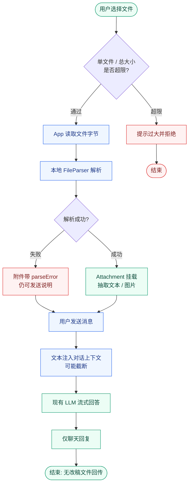

# 文档上传流程（当前实现）

Expert Chat **现在**处理附件的方式：本地解析为文本，注入 LLM 上下文，**不写回、不回传**改好的 Office 文件。

```mermaid
flowchart TD
  start([用户选择文件]) --> sizeCheck{单文件 / 总大小<br/>是否超限?}
  sizeCheck -->|超限| rejectSize[提示过大并拒绝]
  sizeCheck -->|通过| readBytes[App 读取文件字节]
  readBytes --> parseLocal[本地 FileParser 解析]
  parseLocal --> parseOk{解析成功?}
  parseOk -->|失败| attachError[附件带 parseError<br/>仍可发送说明]
  parseOk -->|成功| attachText[Attachment 挂载<br/>抽取文本 / 图片]
  attachError --> userSend[用户发送消息]
  attachText --> userSend
  userSend --> injectCtx[文本注入对话上下文<br/>可能截断]
  injectCtx --> llm[现有 LLM 流式回答]
  llm --> chatOnly[仅聊天回复]
  chatOnly --> endNow([结束: 无改稿文件回传])
  rejectSize --> endFail([结束])

  classDef ok fill:#ECFDF5,stroke:#059669,color:#064E3B
  classDef fail fill:#FEF2F2,stroke:#DC2626,color:#7F1D1D
  classDef proc fill:#EFF6FF,stroke:#2563EB,color:#1E3A8A
  class start,attachText,llm,chatOnly,endNow ok
  class rejectSize,attachError,endFail fail
  class readBytes,parseLocal,injectCtx,userSend proc
```
